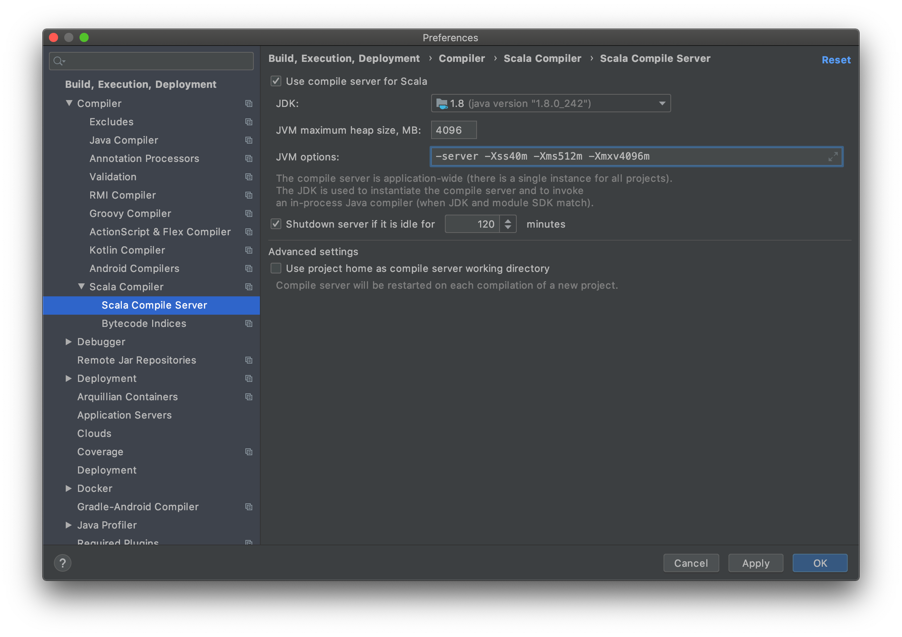
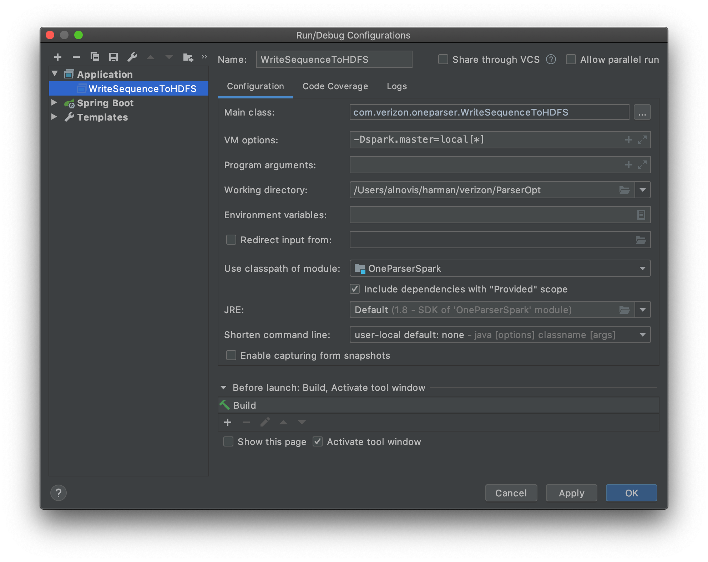

# OneParser BigData project:

## WriteSequenceToHDFS

**How to run:**

Check version of the java SDK is installed in the project settings. Version 8 must be installed.
   
Create required topics and describe it in property files. WriteSequenceToHDFS requires 3 topics

Topic                       | Producer            | Consumer
----------------------------| --------------------|---------------------
dlf,drm_dlf,dml_dlf,sig_dlf | DataCopier          | WriteSequenceToHDFS
nservice                    | WriteSequenceToHDFS | Notification
hiveprocessor               | WriteSequenceToHDFS | ReadSequenceToHive

Note:
- dlf, drm_dlf, dml_dlf, sig_dlf topics must contain objects with schema compatible with com.verizon.oneparser.avroschemas.Logs. Each topic has its own file type (dlf, drm_dlf, dml_dlf, sig_dlf)
- com.verizon.oneparser.broker.KafkaSink.toAvro function provides com.verizon.oneparser.avroschemas.Logs schema 
  to another topics automatically (we just need to create topics)

Note:
Number of spark partitions (parallelization level) is equal too ingestion topics (dlf,drm_dlf,dml_dlf,sig_dlf) partitions number. You can increase ingestion topic partitions number by following bash command:
```
kafka-topics --zookeeper <zookeeper host>:<zookeeper port> --alter --topic <topic> --partitions <num partitions>
```

Make sure that following services are available for your spark master and executors (in case of you run it locally for your host)

Service         | Description          | Local host:port
----------------|----------------------|-----------------
kafka           | Kafka broker         | 127.0.0.1:9092
zookeeper       | Zookeeper            | 127.0.0.1:2181
namenode        | Hadoop NameNode      | 127.0.0.1:9000
datanode        | Hadoop DataNode      | 127.0.0.1:9864
schema-registry | Avro Schema Registry | 127.0.0.1:8081
   
   You can start required services locally by using following [docker-compose file](../dev/docker/docker-compose.yml) - check that 
   the environment variable DOCKER_HOST_IP is set is host.docker.internal in Docker Run.
   
If you run it from you IDE please follow steps above
- Add JVM options `-server -Xss40m -Xms512m -Xmxv4096m` (you will find same config and values in pom.xml)
    
- Enable `Include dependences in "provided" scope` in you run configuration and add `-Dspark.master=local[*]` as JVM params
    
- Configure SDKs
    
    
        
Provide log files to hdfs and add messages to kafka "logs" topic. You can check log files availability by following command (pth may be different)

```
hdfs dfs -ls hdfs://localhost:9000/oneparser/data/dmat/staging/02032020/processed
 Found 3 items
 -rw-r--r--   3 alnovis supergroup  275398964 2020-04-07 16:10 hdfs://localhost:9000/oneparser/data/dmat/staging/02032020/processed/WY3-ELK-NB-010820_2242548975_01_08_2020_11_03_12_PART0.dlf
 -rw-r--r--   3 alnovis supergroup  271861705 2020-04-07 16:10 hdfs://localhost:9000/oneparser/data/dmat/staging/02032020/processed/WY3-ELK-NB-010820_2242548975_01_08_2020_11_03_12_PART1.dlf
 -rw-r--r--   3 alnovis supergroup   23712649 2020-04-07 16:08 hdfs://localhost:9000/oneparser/data/dmat/staging/02032020/processed/WY3-ELK-NB-010820_2242548975_01_08_2020_11_03_12_PART2.dlf
```
   
And kafka topics/offsets by following command 

```
kafka-consumer-groups --bootstrap-server localhost:9092 --describe --group DMATgroupId

Consumer group 'DMATgroupId' has no active members.

GROUP           TOPIC           PARTITION  CURRENT-OFFSET  LOG-END-OFFSET  LAG             CONSUMER-ID     HOST            CLIENT-ID
DMATgroupId     logs            0          1               1               0               -               -               -
DMATgroupId     logs            2          1               1               0               -               -               -
DMATgroupId     logs            1          0               0               0               -               -               -
DMATgroupId     logs            4          0               0               0               -               -               -
DMATgroupId     logs            3          1               1               0               -               -               -
```
   
If you plan to start WriteSequenceToHDFS via `spark-submit` please perform following steps
- Install required libs
```
mvn install:install-file -Dfile=./lib/singleparser-3.1.1.jar -DgroupId=com.vzwdt -DartifactId=singleparser -Dversion=3.1.1 -Dpackaging=jar
(or other versions of the singleparser as needed)
mvn install:install-file -Dfile=./lib/asn1rt-3.1.jar -DgroupId=asn1rt -DartifactId=asn1rt -Dversion=3.1 -Dpackaging=jar
mvn install:install-file -Dfile=./lib/hex-grid_2.11-1.2.jar -DgroupId=com.esri -DartifactId=hex-grid_2.11 -Dversion=1.2 -Dpackaging=jar
mvn install:install-file -Dfile=./lib/spark-gis-0.3.0.jar -DgroupId=org.betterers -DartifactId=spark-gis -Dversion=0.3.0 -Dpackaging=jar
mvn install:install-file -Dfile=./lib/webmercator_2.11-1.4.jar -DgroupId=com.esri -DartifactId=webmercator_2.11 -Dversion=1.4 -Dpackaging=jar
mvn install:install-file -Dfile=./lib/qc-parser-0.0.1.jar -DgroupId=com.dmat.qc.parser -DartifactId=qc-parser -Dversion=0.0.1 -Dpackaging=jar
mvn install:install-file -Dfile=./lib/PCAPParser-1.4.jar -DgroupId=com.verizon -DartifactId=PCAPParser -Dversion=1.4 -Dpackaging=jar
mvn install:install-file -Dfile=./lib/IPParser-1.1.0.jar -DgroupId=com.parser -DartifactId=IPParser -Dversion=1.1.0 -Dpackaging=jar
```
- Build application by maven
 ```
mvn clean install

mvn install jib:dockerBuild for hdfs-copier and notification (if this conteiners were not created automatically)
 ```
- Сhanging the host for spark app (j-configs)
 ```
hdfs://host.docker.internal:9000 - for j0.conig (Instead of hdfs://namenode:9000)

hdfs://namenode:9000 - for j1.conig & j2.config

add 127.0.0.1 namenode in etc/hosts on the local machine

for the rest of the services from docker-compose, we change the hosts to the localhost
 ```
- Run spark-submit (according to [Structured Streaming + Kafka Integration](https://spark.apache.org/docs/2.4.5/structured-streaming-kafka-integration.html#deploying))
 ```
 For WriteSequenceToHDFS Set:
 
 Run-> Edit configurations -> Spark submit (local):
 
 Spark home: C:/Users/alnovis/Downloads/spark-2.4.5-bin-hadoop2.7/
 
 Application: file://C:/Users/alnovis/IdeaProjects/ParserOpt/OneParserSpark/target/OneParserSpark-1.0-SNAPSHOT-shaded.jar
 
 Master: local [*]
 
 Properties file: C:/Users/alnovis/IdeaProjects/ParserOpt/dev/j0.config
 
 Dependencies: Files: file://C:/Users/alnovis/IdeaProjects/ParserOpt/OneParserSpark/src/main/resources/log4j.properties
 
 Packages: org.apache.spark:spark-sql-kafka-0-10_2.11:2.4.5
 
 Driver: Memory: 4G
 
 Java options: -agentlib:jdwp=transport=dt_socket,server=y,suspend=n,address=0.0.0.0:5081 -Dlog4j.configuration=file:C:/Users/alnovis/IdeaProjects/ParserOpt/OneParserSpark/src/main/resources/log4j.properties
 
 Executor memory: 4G
 
 For other jobs (ReadSequenceToHive, ProcessDMATRecords) the settings are similar.
 
 OR in Terminal:
 
spark-submit --master local[*] \
    --properties-file ./src/main/resources/properties/dev/j0.config \
    --files /Users/alnovis/verizon/ParserOpt/OneParserSpark/src/main/resources/log4j.properties \
    --conf spark.driver.extraJavaOptions='-Dlog4j.configuration=file:/Users/alnovis/verizon/ParserOpt/OneParserSpark/src/main/resources/log4j.properties' \
    --packages org.apache.spark:spark-sql-kafka-0-10_2.11:2.4.5 \
    --class com.verizon.oneparser.WriteSequenceToHDFS target/OneParserSpark-1.0-SNAPSHOT-shaded.jar
 ```


 ```
spark-submit --master local[*] \
    --properties-file ./src/main/resources/properties/dev/j1.config \
    --files /Users/alnovis/verizon/ParserOpt/OneParserSpark/src/main/resources/log4j.properties \
    --conf spark.driver.extraJavaOptions='-Dlog4j.configuration=file:/Users/alnovis/verizon/ParserOpt/OneParserSpark/src/main/resources/log4j.properties' \
    --packages org.apache.spark:spark-sql-kafka-0-10_2.11:2.4.5 \
    --class com.verizon.oneparser.ReadSequenceToHiveNew target/OneParserSpark-1.0-SNAPSHOT-shaded.jar
 ```
 
 ```
spark-submit --master local[*] \
    --properties-file ./src/main/resources/properties/dev/j2.config \
    --files /Users/alnovis/verizon/ParserOpt/OneParserSpark/src/main/resources/log4j.properties \
    --conf spark.driver.extraJavaOptions='-Dlog4j.configuration=file:/Users/alnovis/verizon/ParserOpt/OneParserSpark/src/main/resources/log4j.properties' \
    --packages org.apache.spark:spark-sql-kafka-0-10_2.11:2.4.5 \
    --class com.verizon.oneparser.ProcessDMATRecords target/OneParserSpark-1.0-SNAPSHOT-shaded.jar
	
```

